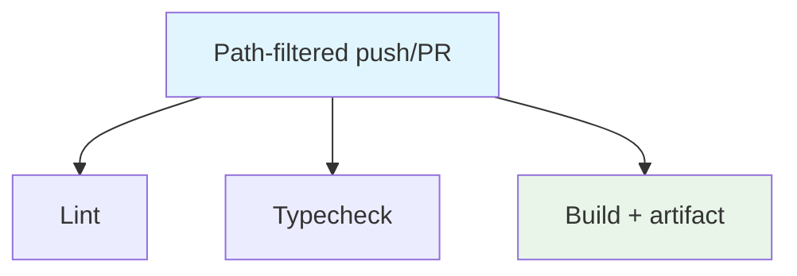

## Workflow Overview

**Purpose**: Lint, typecheck, and build the Next.js migration tree.
**Trigger Events**: Push/PR to main/develop when `nextjs-migration/**` changes.
**Target Environments**: Ephemeral Ubuntu CI.

## Execution Flow Diagram

## Jobs & Dependencies

| Job Name | Purpose | Dependencies | Execution Context |
|---|---|---|---|
| lint | ESLint in nextjs-migration | none | ubuntu-latest, Node 18 |
| typecheck | tsc --noEmit | none | ubuntu-latest, Node 18 |
| build | next build + artifact | none | ubuntu-latest, Node 18 |

## Requirements Matrix

| ID | Requirement | Priority | Acceptance Criteria |
|---|---|---|---|
| REQ-001 | Path filter | High | Unrelated paths do not run CI |
| REQ-002 | Working directory | High | All npm commands run in `./nextjs-migration` |
| REQ-003 | Cancel superseded | High | concurrency cancel-in-progress |

## Known gap

`nextjs-migration/` is not present on `main`. This workflow is currently a no-op or a failing path filter with no matching tree. Keep the spec; restore the directory or retarget paths before relying on the gate.

## Secrets & Variables

None.

## Validation Criteria

- VLD-001: Jobs declare working-directory `./nextjs-migration`
- VLD-002: Artifact path is `nextjs-migration/.next`

## Change Management

| Version | Date | Changes | Author |
|---|---|---|---|
| 1.0 | 2026-08-23 | Initial specification | fleet audit |
