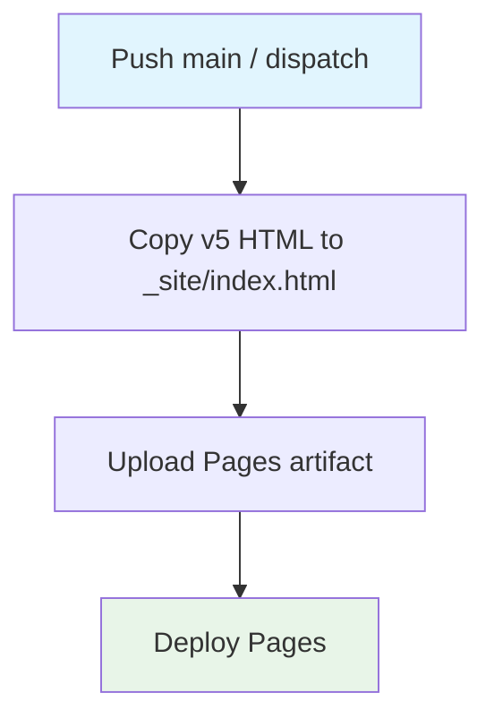

## Workflow Overview

**Purpose**: Publish the v5 static editor HTML as the GitHub Pages site.
**Trigger Events**: Push to `main`; manual dispatch.
**Target Environments**: github-pages.

## Execution Flow Diagram

## Jobs & Dependencies

| Job Name | Purpose | Dependencies | Execution Context |
|---|---|---|---|
| deploy | Static Pages publish | none | ubuntu-latest, environment github-pages |

## Requirements Matrix

| ID | Requirement | Priority | Acceptance Criteria |
|---|---|---|---|
| REQ-001 | Least privilege | High | contents:read, pages:write, id-token:write |
| REQ-002 | Source files | High | `ctrb_web_editor_v5.html` and `CAMPAIGN_EXAMPLES.json` |
| REQ-003 | One deploy at a time | High | concurrency group `pages` |

## Secrets & Variables

OIDC via `id-token: write`. No extra secrets.

## Validation Criteria

- VLD-001: Site index is the v5 HTML
- VLD-002: Campaign examples are published beside it

## Change Management

| Version | Date | Changes | Author |
|---|---|---|---|
| 1.0 | 2026-08-23 | Initial specification | fleet audit |
